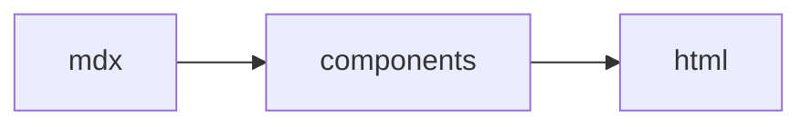

The catalog is organized by the kind of document each group serves. `mdxr catalog` lists every component available in your project — built-ins plus [project-defined](/configuration#project-defined-components) ones — and `mdxr catalog --json` is the machine-readable source of truth for names and attributes.

Each section ends with a Preview/Code pair: a real `.mdx` document from [`examples/catalog/`](https://github.com/SuzumiyaAoba/mdxr/tree/master/examples/catalog) rendered by `mdxr render` during the docs build — hydration included, so interactive components work inside the frame — next to the source that produced it.

## Document scaffolding

The frame every deliverable sits in: headers, callouts, navigation, references.

| Component | What it is |
| --- | --- |
| `<Plan>` | Document root — title header, status badge, meta row (auto-built from frontmatter) |
| `<Meta>` / `<MetaItem>` | Metadata row (`Date · Owner · …`); custom items with an icon |
| `<Callout>` | Highlighted block — `:::note`/`:::warning`/`:::goal`/`:::decision`/…, `> [!NOTE]` |
| `<Details>` | Collapsible section on native `<details>` (works without JS) |
| `<Toc>` | Collapsible, auto-built table of contents — `:::toc` |
| `<Glossary>` / `<Term>` | Definition list for domain terms |
| `<Figure>` | Image with a caption |
| `<Ref>` / `<Issue>` / `<PR>` / `<Commit>` | Linked reference card / inline GitHub chips |
| `<Cmd>` | Inline command chip with copy button |
| `<Icon>` | Inline Iconify SVG — `lucide` + `vscode-icons` bundled, no runtime fetch |
| fenced code / math | Highlighted code block with filename bar and line markers; ` ```mermaid ` diagrams; KaTeX `$…$` |

{/* demo:scaffolding — regenerated by scripts/sync-demo-pages.ts */}

### Overview

<Tabs syncKey="components-scaffolding-overview">
  <Tab title="Preview">

<iframe src={`${import.meta.env.BASE_URL}/components/scaffolding--overview.html`} title="Overview" loading="lazy" style="width:100%;height:480px;border:1px solid #d4d4d8;border-radius:8px;background:#fff" />

  </Tab>
  <Tab title="Code">

````mdx
The frame every deliverable sits in — headers, callouts, navigation, references. Frontmatter `status:` / `date:` / `owner:` produced the badge and meta row above.

<Meta>
  <MetaItem label="Branch" icon="lucide:git-branch">docs/catalog</MetaItem>
  <MetaItem label="Repo" icon="lucide:github">mdxr</MetaItem>
</Meta>
````

  </Tab>
</Tabs>


### Callouts

<Tabs syncKey="components-scaffolding-callouts">
  <Tab title="Preview">

<iframe src={`${import.meta.env.BASE_URL}/components/scaffolding--callouts.html`} title="Callouts" loading="lazy" style="width:100%;height:480px;border:1px solid #d4d4d8;border-radius:8px;background:#fff" />

  </Tab>
  <Tab title="Code">

````mdx
:::note
`:::note`, `> [!NOTE]` and `<Callout kind="note">` all produce this block.
:::

:::warning
Warnings get a yellow accent.
:::

:::goal
Goal blocks state intent.
:::

:::decision
Decision callouts mark choices that are settled.
:::
````

  </Tab>
</Tabs>


### Collapsible details

<Tabs syncKey="components-scaffolding-collapsible-details">
  <Tab title="Preview">

<iframe src={`${import.meta.env.BASE_URL}/components/scaffolding--collapsible-details.html`} title="Collapsible details" loading="lazy" style="width:100%;height:480px;border:1px solid #d4d4d8;border-radius:8px;background:#fff" />

  </Tab>
  <Tab title="Code">

````mdx
<Details summary="Native details — opens without JS">
Hidden until clicked. This one starts closed.
</Details>

<Details summary="Starts open" open>
The `open` attribute expands the section on load.
</Details>
````

  </Tab>
</Tabs>


### Glossary

<Tabs syncKey="components-scaffolding-glossary">
  <Tab title="Preview">

<iframe src={`${import.meta.env.BASE_URL}/components/scaffolding--glossary.html`} title="Glossary" loading="lazy" style="width:100%;height:480px;border:1px solid #d4d4d8;border-radius:8px;background:#fff" />

  </Tab>
  <Tab title="Code">

````mdx
<Glossary>
  <Term name="MDX">Markdown extended with JSX components.</Term>
  <Term name="Directive">`:::name` container mapping to a component.</Term>
</Glossary>
````

  </Tab>
</Tabs>


### References

<Tabs syncKey="components-scaffolding-references">
  <Tab title="Preview">

<iframe src={`${import.meta.env.BASE_URL}/components/scaffolding--references.html`} title="References" loading="lazy" style="width:100%;height:480px;border:1px solid #d4d4d8;border-radius:8px;background:#fff" />

  </Tab>
  <Tab title="Code">

````mdx
<Ref href="https://mdxjs.com" title="MDX documentation">
The component model mdxr builds on.
</Ref>

Inline GitHub chips: <Issue repo="SuzumiyaAoba/mdxr" number="1" /> <PR repo="SuzumiyaAoba/mdxr" number="2" /> <Commit repo="SuzumiyaAoba/mdxr" sha="80c3b8d0123456789abcd">docs site</Commit>
````

  </Tab>
</Tabs>


### Commands and icons

<Tabs syncKey="components-scaffolding-commands-and-icons">
  <Tab title="Preview">

<iframe src={`${import.meta.env.BASE_URL}/components/scaffolding--commands-and-icons.html`} title="Commands and icons" loading="lazy" style="width:100%;height:480px;border:1px solid #d4d4d8;border-radius:8px;background:#fff" />

  </Tab>
  <Tab title="Code">

````mdx
Run <Cmd>pnpm build</Cmd> then <Cmd>mdxr render plan.mdx</Cmd> — inline chips carry copy buttons. Icons: <Icon name="lucide:rocket" className="h-4 w-4" /> <Icon name="lucide:check" className="h-4 w-4" /> <Icon name="vscode-icons:file-type-typescript" className="h-4 w-4" />
````

  </Tab>
</Tabs>


### Fenced code

<Tabs syncKey="components-scaffolding-fenced-code">
  <Tab title="Preview">

<iframe src={`${import.meta.env.BASE_URL}/components/scaffolding--fenced-code.html`} title="Fenced code" loading="lazy" style="width:100%;height:480px;border:1px solid #d4d4d8;border-radius:8px;background:#fff" />

  </Tab>
  <Tab title="Code">

````mdx
```ts ln title="src/hello.ts"
const a = 1;
const b = 2; // [!code hl]
const c = a + b; // [!code warning]
return c;
```


````

  </Tab>
</Tabs>


### Task list

<Tabs syncKey="components-scaffolding-task-list">
  <Tab title="Preview">

<iframe src={`${import.meta.env.BASE_URL}/components/scaffolding--task-list.html`} title="Task list" loading="lazy" style="width:100%;height:480px;border:1px solid #d4d4d8;border-radius:8px;background:#fff" />

  </Tab>
  <Tab title="Code">

````mdx
- [x] Render the demos
- [ ] Ship the docs
````

  </Tab>
</Tabs>

{/* /demo:scaffolding */}

<a href={`${import.meta.env.BASE_URL}/components/scaffolding.html`}>Open full page</a> · [Source](https://github.com/SuzumiyaAoba/mdxr/blob/master/examples/catalog/scaffolding.mdx)

## Planning & status

Implementation plans, milestones, task tracking, and decision records.

| Component | What it is |
| --- | --- |
| `<Phase>` | Section heading with a status badge — `:::phase` |
| `<Steps>` / `<Step>` | Status-aware task list with optional progress bar; owner/effort/priority/due chips |
| `<Timeline>` / `<Event>` | Dated milestone rail — `:::timeline` |
| `<Gantt>` / `<Task>` / `<Milestone>` | Date-based schedule chart — `:::gantt` |
| `<Decision>` | ADR-lite decision record |
| `<Option>` | Alternative-comparison card (recommended/considered/rejected) |
| `<Risk>` | Risk block — severity pill + mitigation line |
| `<Approvals>` / `<Approval>` | Sign-off list |
| `<Stats>` / `<Stat>` | Metric card grid; `delta` colored by sign |
| `<Priority>` `<Effort>` `<Due>` `<Owner>` | Inline chips (priority, T-shirt effort, deadline, person) |
| `<Reqs>` / `<Req>` | Requirement / acceptance-criteria rows |
| `<Board>` / `<Lane>` / `<BoardCard>` | Interactive kanban — cards drag between lanes, "Copy markdown" emits the updated markup — `:::board` |
| `<Matrix>` | Comparison grid — `yes`/`no`/`partial`/`✓`/`✗`/`△` cells render as icons — `:::matrix` |
| `<Summary>` | Progress bar |
| `<StatusBadge>` | Standalone status pill |

{/* demo:planning — regenerated by scripts/sync-demo-pages.ts */}

### Overview

<Tabs syncKey="components-planning-overview">
  <Tab title="Preview">

<iframe src={`${import.meta.env.BASE_URL}/components/planning--overview.html`} title="Overview" loading="lazy" style="width:100%;height:480px;border:1px solid #d4d4d8;border-radius:8px;background:#fff" />

  </Tab>
  <Tab title="Code">

````mdx
Implementation plans, milestones, task tracking, and decision records.

:::phase{title="Phase 1 — Foundation" status="done"}

<Steps progress>
  <Step status="done">Read the existing parser</Step>
  <Step status="done">MDX compile via evaluate()</Step>
</Steps>

:::

:::phase{title="Phase 2 — Migration" status="doing" owner="@alice" due="2026-09-30"}

<Steps progress>
  <Step status="done" effort="s">Directive transform</Step>
  <Step status="doing" owner="@alice" priority="p1" due="2026-09-25">
    Component catalog
  </Step>
  <Step status="todo" effort="m" owner="@bob">Update snapshots</Step>
  <Step status="blocked">Publish release</Step>
</Steps>

:::
````

  </Tab>
</Tabs>


### Timeline

<Tabs syncKey="components-planning-timeline">
  <Tab title="Preview">

<iframe src={`${import.meta.env.BASE_URL}/components/planning--timeline.html`} title="Timeline" loading="lazy" style="width:100%;height:480px;border:1px solid #d4d4d8;border-radius:8px;background:#fff" />

  </Tab>
  <Tab title="Code">

````mdx
<Timeline title="Milestones">
  <Event date="2026-09-10" status="done" title="Skeleton merged" />
  <Event date="2026-09-16" status="doing" title="Catalog complete" />
  <Event date="2026-09-30" status="todo" title="v1.0 freeze" />
</Timeline>
````

  </Tab>
</Tabs>


### Gantt

<Tabs syncKey="components-planning-gantt">
  <Tab title="Preview">

<iframe src={`${import.meta.env.BASE_URL}/components/planning--gantt.html`} title="Gantt" loading="lazy" style="width:100%;height:480px;border:1px solid #d4d4d8;border-radius:8px;background:#fff" />

  </Tab>
  <Tab title="Code">

````mdx
<Gantt title="v1.0 release">
  <Task name="API design" start="2026-09-01" end="2026-09-05" status="done" />
  <Task name="Implementation" start="2026-09-08" end="2026-09-18" status="doing" progress="40" owner="alice" />
  <Task name="Docs" start="2026-09-21" end="2026-09-25" />
  <Milestone name="v1.0 freeze" date="2026-09-30" />
</Gantt>
````

  </Tab>
</Tabs>


### Decision & options

<Tabs syncKey="components-planning-decision-options">
  <Tab title="Preview">

<iframe src={`${import.meta.env.BASE_URL}/components/planning--decision-options.html`} title="Decision & options" loading="lazy" style="width:100%;height:480px;border:1px solid #d4d4d8;border-radius:8px;background:#fff" />

  </Tab>
  <Tab title="Code">

````mdx
<Columns>
  <Option title="Template literals" status="rejected">
    Escaping bugs keep recurring.
  </Option>
  <Option title="Component pipeline" status="recommended">
    Deterministic + validated.
  </Option>
</Columns>

<Decision title="Use renderToStaticMarkup" status="accepted" date="2026-09-12">
Documents have no data fetching — a synchronous renderer keeps the CLI simple.
</Decision>
````

  </Tab>
</Tabs>


### Risk & approvals

<Tabs syncKey="components-planning-risk-approvals">
  <Tab title="Preview">

<iframe src={`${import.meta.env.BASE_URL}/components/planning--risk-approvals.html`} title="Risk & approvals" loading="lazy" style="width:100%;height:480px;border:1px solid #d4d4d8;border-radius:8px;background:#fff" />

  </Tab>
  <Tab title="Code">

````mdx
<Risk level="high" title="Ecosystem drift" mitigation="Pin @mdx-js/mdx">
`evaluate()` semantics changed across majors before.
</Risk>

<Approvals>
  <Approval name="alice" role="tech lead" status="approved" date="2026-09-14" />
  <Approval name="bob" role="security" status="pending" />
</Approvals>
````

  </Tab>
</Tabs>


### Stats, chips & progress

<Tabs syncKey="components-planning-stats-chips-progress">
  <Tab title="Preview">

<iframe src={`${import.meta.env.BASE_URL}/components/planning--stats-chips-progress.html`} title="Stats, chips & progress" loading="lazy" style="width:100%;height:480px;border:1px solid #d4d4d8;border-radius:8px;background:#fff" />

  </Tab>
  <Tab title="Code">

````mdx
<Stats>
  <Stat value="68" label="call sites migrated" delta="+12" />
  <Stat value="120ms" label="p95 render" delta="-34%" />
  <Stat value="9" label="packages" />
</Stats>

Inline chips: <Priority level="p1" /> <Effort size="m">3d</Effort> <Due date="2026-10-01" /> <Owner name="alice" role="lead" /> <StatusBadge status="doing" />

<Summary done="4" total="9" label="Overall progress" />
````

  </Tab>
</Tabs>


### Requirements

<Tabs syncKey="components-planning-requirements">
  <Tab title="Preview">

<iframe src={`${import.meta.env.BASE_URL}/components/planning--requirements.html`} title="Requirements" loading="lazy" style="width:100%;height:480px;border:1px solid #d4d4d8;border-radius:8px;background:#fff" />

  </Tab>
  <Tab title="Code">

````mdx
<Reqs>
  <Req id="REQ-1" status="done">Documents render without client JS</Req>
  <Req id="REQ-2" status="doing">Interactive primitives hydrate</Req>
</Reqs>
````

  </Tab>
</Tabs>


### Board

<Tabs syncKey="components-planning-board">
  <Tab title="Preview">

<iframe src={`${import.meta.env.BASE_URL}/components/planning--board.html`} title="Board" loading="lazy" style="width:100%;height:480px;border:1px solid #d4d4d8;border-radius:8px;background:#fff" />

  </Tab>
  <Tab title="Code">

````mdx
<Board title="Sprint 12">
  <Lane title="Todo" status="todo">
    <BoardCard title="Write migration guide" priority="p1" owner="alice" />
  </Lane>
  <Lane title="In progress" status="doing">
    <BoardCard title="Graph component" due="2026-09-20">
      dagre layout + svg edges
    </BoardCard>
  </Lane>
  <Lane title="Done" status="done">
    <BoardCard title="Ship v0.1" status="done" />
  </Lane>
</Board>
````

  </Tab>
</Tabs>


### Matrix

<Tabs syncKey="components-planning-matrix">
  <Tab title="Preview">

<iframe src={`${import.meta.env.BASE_URL}/components/planning--matrix.html`} title="Matrix" loading="lazy" style="width:100%;height:480px;border:1px solid #d4d4d8;border-radius:8px;background:#fff" />

  </Tab>
  <Tab title="Code">

````mdx
<Matrix title="Renderer comparison" cols="mdxr,raw mdx,astro">
- standalone html | yes | no | partial
- editor links | yes | no | no
- hydration | no | yes | yes
</Matrix>
````

  </Tab>
</Tabs>

{/* /demo:planning */}

<a href={`${import.meta.env.BASE_URL}/components/planning.html`}>Open full page</a> · [Source](https://github.com/SuzumiyaAoba/mdxr/blob/master/examples/catalog/planning.mdx)

## Code investigation

Findings, hypotheses, and the evidence trail — terminals, traces, searches, files.

| Component | What it is |
| --- | --- |
| `<Findings>` / `<Finding>` | Numbered findings with confidence pills — `:::findings` |
| `<Hypotheses>` / `<Hypothesis>` | Hypothesis ledger (supported/refuted/untested) — `:::hypotheses` |
| `<Terminal>` | Command transcript (`$` prompts, output, exit badge) — `:::terminal`, ` ```console ` |
| `<Trace>` / `<TraceFrame>` | Stack/call trace with error line, dimmed lib frames — `:::trace` |
| `<Searches>` / `<Search>` | Search-query log (pattern/scope/tool/hits) — `:::searches` |
| `<Files>` / `<File>` | Related-file inventory — `:::files` |
| `<Deps>` / `<Dep>` | Dependency-edge list — `:::deps` |
| `<Changes>` / `<Change>` | Change-set list (add/modify/delete/rename) |
| `<Flow>` / `<FlowStep>` | Numbered call/execution chain — `:::flow` |
| `<Tree>` | File tree from a nested list — collapsible folders, automatic icons |
| `<FileRef>` / `<SymbolRef>` | Inline file / symbol reference chips with copy button |
| `<CodeFile>` | Embeds a real file from disk as a code block |
| `<Props>` / `<Prop>` | API/props table for a component or function |

{/* demo:investigation — regenerated by scripts/sync-demo-pages.ts */}

### Findings

<Tabs syncKey="components-investigation-findings">
  <Tab title="Preview">

<iframe src={`${import.meta.env.BASE_URL}/components/investigation--findings.html`} title="Findings" loading="lazy" style="width:100%;height:480px;border:1px solid #d4d4d8;border-radius:8px;background:#fff" />

  </Tab>
  <Tab title="Code">

````mdx
<Findings title="Investigation results">
  <Finding confidence="confirmed" title="Rendering is synchronous">
    `mdxToHtml` awaits `evaluate()` then calls `renderToStaticMarkup`.
  </Finding>
  <Finding confidence="inferred" title="Directives expand before eval">
    The remark pass rewrites `:::x` containers into JSX elements.
  </Finding>
  <Finding confidence="unverified" title="Watch-mode reloads">
    Probably, but no test covers it.
  </Finding>
</Findings>
````

  </Tab>
</Tabs>


### Hypotheses

<Tabs syncKey="components-investigation-hypotheses">
  <Tab title="Preview">

<iframe src={`${import.meta.env.BASE_URL}/components/investigation--hypotheses.html`} title="Hypotheses" loading="lazy" style="width:100%;height:480px;border:1px solid #d4d4d8;border-radius:8px;background:#fff" />

  </Tab>
  <Tab title="Code">

````mdx
<Hypotheses title="Hypotheses tested">
  <Hypothesis status="refuted" title="CSS loads at runtime">
    Ruled out — the stylesheet is inlined into the HTML.
  </Hypothesis>
  <Hypothesis status="supported" title="Directives expand before eval" />
  <Hypothesis status="untested" title="HMR works in serve" />
</Hypotheses>
````

  </Tab>
</Tabs>


### Terminal & trace

<Tabs syncKey="components-investigation-terminal-trace">
  <Tab title="Preview">

<iframe src={`${import.meta.env.BASE_URL}/components/investigation--terminal-trace.html`} title="Terminal & trace" loading="lazy" style="width:100%;height:480px;border:1px solid #d4d4d8;border-radius:8px;background:#fff" />

  </Tab>
  <Tab title="Code">

````mdx
<Terminal cmd="pnpm test" exit="1" title="test run">

```
FAIL  tests/render.test.ts
  ✗ renders markdown prose
```

</Terminal>

<Trace error="TypeError: Cannot read properties of undefined (reading 'kind')">
  <TraceFrame name="toMdxComponent" path="src/remark/directives.ts" lines="64">
    leaf directives have no attributes record
  </TraceFrame>
  <TraceFrame name="visit" path="node_modules/unist-util-visit/index.js" kind="lib" />
  <TraceFrame name="remarkMdxrDirectives" path="src/remark/directives.ts" lines="91" />
</Trace>
````

  </Tab>
</Tabs>


### Searches

<Tabs syncKey="components-investigation-searches">
  <Tab title="Preview">

<iframe src={`${import.meta.env.BASE_URL}/components/investigation--searches.html`} title="Searches" loading="lazy" style="width:100%;height:480px;border:1px solid #d4d4d8;border-radius:8px;background:#fff" />

  </Tab>
  <Tab title="Code">

````mdx
<Searches title="How the code was searched">
  <Search pattern="evaluate" path="src/" tool="rg" hits="3" />
  <Search pattern="hydrateRoot" path="src/" tool="rg" hits="0">
    Dead end — there is no client entry point.
  </Search>
</Searches>
````

  </Tab>
</Tabs>


### Files & changes

<Tabs syncKey="components-investigation-files-changes">
  <Tab title="Preview">

<iframe src={`${import.meta.env.BASE_URL}/components/investigation--files-changes.html`} title="Files & changes" loading="lazy" style="width:100%;height:480px;border:1px solid #d4d4d8;border-radius:8px;background:#fff" />

  </Tab>
  <Tab title="Code">

````mdx
<Files title="Files involved">
  <File path="src/mdx.ts" kind="entry" lines="70-106">
    Pipeline entry.
  </File>
  <File path="src/define.ts" kind="types" />
  <File path="tests/render.test.ts" kind="test" />
</Files>

<Changes>
  <Change kind="add" path="src/remark/headings.ts">slug + toc expansion</Change>
  <Change kind="modify" path="src/mdx.ts" />
  <Change kind="rename" path="src/old.ts" to="src/new.ts" />
  <Change kind="delete" path="src/dead.ts" />
</Changes>

<Deps title="Module dependencies">
  <Dep from="src/cli.ts" to="src/render.ts" kind="calls" />
  <Dep from="src/mdx.ts" to="remark-directive" kind="imports" />
  <Dep from="src/render.ts" to="dist/out.html" kind="writes" />
</Deps>
````

  </Tab>
</Tabs>


### Flow

<Tabs syncKey="components-investigation-flow">
  <Tab title="Preview">

<iframe src={`${import.meta.env.BASE_URL}/components/investigation--flow.html`} title="Flow" loading="lazy" style="width:100%;height:480px;border:1px solid #d4d4d8;border-radius:8px;background:#fff" />

  </Tab>
  <Tab title="Code">

````mdx
<Flow title="Request path">
  <FlowStep name="cli()" path="src/cli.ts" lines="12-30">
    Parses argv, loads config.
  </FlowStep>
  <FlowStep name="mdxToHtml()" path="src/mdx.ts">
    Compiles MDX and evaluates it.
  </FlowStep>
  <FlowStep name="renderToStaticMarkup()">
    Produces the final HTML string.
  </FlowStep>
</Flow>
````

  </Tab>
</Tabs>


### Tree

<Tabs syncKey="components-investigation-tree">
  <Tab title="Preview">

<iframe src={`${import.meta.env.BASE_URL}/components/investigation--tree.html`} title="Tree" loading="lazy" style="width:100%;height:480px;border:1px solid #d4d4d8;border-radius:8px;background:#fff" />

  </Tab>
  <Tab title="Code">

````mdx
<Tree root="mdxr/">

- src/
  - render.ts — pipeline entry
  - ui/
    - **plan.tsx**
    - steps.tsx
    - …
- package.json
- ...

</Tree>
````

  </Tab>
</Tabs>


### Inline references & props

<Tabs syncKey="components-investigation-inline-references-props">
  <Tab title="Preview">

<iframe src={`${import.meta.env.BASE_URL}/components/investigation--inline-references-props.html`} title="Inline references & props" loading="lazy" style="width:100%;height:480px;border:1px solid #d4d4d8;border-radius:8px;background:#fff" />

  </Tab>
  <Tab title="Code">

````mdx
See <FileRef path="mdxr.config.ts" /> for the config that registered the components on the custom page. <SymbolRef name="mdxToHtml" kind="fn" path="src/mdx.ts" lines="70-106" /> returns <SymbolRef name="MdxResult" kind="interface" />.

<Props of="Step">
  <Prop name="status" type="todo | doing | done | blocked" required>
    Marker state.
  </Prop>
  <Prop name="effort" type="xs | s | m | l | xl" default="m" />
</Props>
````

  </Tab>
</Tabs>


### Embedded source

<Tabs syncKey="components-investigation-embedded-source">
  <Tab title="Preview">

<iframe src={`${import.meta.env.BASE_URL}/components/investigation--embedded-source.html`} title="Embedded source" loading="lazy" style="width:100%;height:480px;border:1px solid #d4d4d8;border-radius:8px;background:#fff" />

  </Tab>
  <Tab title="Code">

````mdx
<CodeFile path="mdxr.config.ts" />
````

  </Tab>
</Tabs>

{/* /demo:investigation */}

<a href={`${import.meta.env.BASE_URL}/components/investigation.html`}>Open full page</a> · [Source](https://github.com/SuzumiyaAoba/mdxr/blob/master/examples/catalog/investigation.mdx)

## Output artifacts

The things a change produces: diffs, graphs, test runs, endpoints, timing.

| Component | What it is |
| --- | --- |
| ` ```diff ` / ` ```patch ` fence | Structured per-file diff cards — editor links, `+N −M` stats, hunk line numbers |
| `<Comments>` / `<Comment>` | Comment threads anchored to code/diff lines — `:::comments` |
| `<Graph>` / `<Node>` / `<Edge>` | Static node/edge diagram — dagre layout at render time — `:::graph` |
| `<Tests>` / `<Test>` | Test-run report — status pills, auto counts and duration sum — `:::tests` |
| `<Endpoints>` / `<Endpoint>` | API route list — method chips, `base` prefix, `auth`/`deprecated` — `:::endpoints` |
| `<Json>` | Collapsible JSON tree on nested `<details>` |
| `<Waterfall>` / `<Span>` | Timing waterfall (OTel-trace-style bars) — `:::waterfall` |
| `<Ins>` / `<Del>` | Inline word-level edits — semantic `<ins>`/`<del>` |

{/* demo:artifacts — regenerated by scripts/sync-demo-pages.ts */}

### Diff cards

<Tabs syncKey="components-artifacts-diff-cards">
  <Tab title="Preview">

<iframe src={`${import.meta.env.BASE_URL}/components/artifacts--diff-cards.html`} title="Diff cards" loading="lazy" style="width:100%;height:480px;border:1px solid #d4d4d8;border-radius:8px;background:#fff" />

  </Tab>
  <Tab title="Code">

````mdx
```diff title="src/render.ts"
@@ -40,7 +40,8 @@
   const doc = compile(src);
-  const out = doc;
+  const out = minify(doc);
+  log.info("rendered");
   return out;
```
````

  </Tab>
</Tabs>


### Anchored comments

<Tabs syncKey="components-artifacts-anchored-comments">
  <Tab title="Preview">

<iframe src={`${import.meta.env.BASE_URL}/components/artifacts--anchored-comments.html`} title="Anchored comments" loading="lazy" style="width:100%;height:480px;border:1px solid #d4d4d8;border-radius:8px;background:#fff" />

  </Tab>
  <Tab title="Code">

````mdx
<Comments>

```ts title="src/x.ts"
const a = 1;
const b = 2;
const c = a + b;
```

<Comment lines="2" author="@devin" severity="medium">
derive b from a
</Comment>

<Comment lines="3" author="@alice" severity="low">
consider a comment on the intent
</Comment>

</Comments>
````

  </Tab>
</Tabs>


### Graph

<Tabs syncKey="components-artifacts-graph">
  <Tab title="Preview">

<iframe src={`${import.meta.env.BASE_URL}/components/artifacts--graph.html`} title="Graph" loading="lazy" style="width:100%;height:480px;border:1px solid #d4d4d8;border-radius:8px;background:#fff" />

  </Tab>
  <Tab title="Code">

````mdx
<Graph title="mdx → html pipeline" direction="right">
  <Node id="doc" label="plan.mdx" path="examples/plan.mdx" />
  <Node id="eval" label="evaluate" note="@mdx-js/mdx" />
  <Node id="out" label="out.html" path="examples/out.html" />
  <Edge from="doc" to="eval" kind="reads" />
  <Edge from="eval" to="out" kind="writes" label="static markup" />
</Graph>
````

  </Tab>
</Tabs>


### Tests

<Tabs syncKey="components-artifacts-tests">
  <Tab title="Preview">

<iframe src={`${import.meta.env.BASE_URL}/components/artifacts--tests.html`} title="Tests" loading="lazy" style="width:100%;height:480px;border:1px solid #d4d4d8;border-radius:8px;background:#fff" />

  </Tab>
  <Tab title="Code">

````mdx
<Tests title="render.test.ts" tool="vitest">
  <Test name="renders markdown prose" status="pass" duration="12ms" />
  <Test name="renders a Plan header" status="pass" duration="31ms" />
  <Test name="rejects invalid props" status="fail" duration="800ms" file="tests/render.test.ts" lines="96">
    AssertionError: expected body to contain "Invalid props"
  </Test>
</Tests>
````

  </Tab>
</Tabs>


### Endpoints

<Tabs syncKey="components-artifacts-endpoints">
  <Tab title="Preview">

<iframe src={`${import.meta.env.BASE_URL}/components/artifacts--endpoints.html`} title="Endpoints" loading="lazy" style="width:100%;height:480px;border:1px solid #d4d4d8;border-radius:8px;background:#fff" />

  </Tab>
  <Tab title="Code">

````mdx
<Endpoints title="User service" base="/api/v1">
  <Endpoint method="GET" path="/users">
    List users, paginated.
  </Endpoint>
  <Endpoint method="POST" path="/users" auth="admin">
    Create a user.
  </Endpoint>
  <Endpoint method="GET" path="/legacy/users" deprecated="true" />
</Endpoints>
````

  </Tab>
</Tabs>


### JSON

<Tabs syncKey="components-artifacts-json">
  <Tab title="Preview">

<iframe src={`${import.meta.env.BASE_URL}/components/artifacts--json.html`} title="JSON" loading="lazy" style="width:100%;height:480px;border:1px solid #d4d4d8;border-radius:8px;background:#fff" />

  </Tab>
  <Tab title="Code">

````mdx
<Json title="tool result">

```json
{ "name": "mdxr", "stats": { "files": 12 }, "tags": ["agent", "render"] }
```

</Json>
````

  </Tab>
</Tabs>


### Waterfall

<Tabs syncKey="components-artifacts-waterfall">
  <Tab title="Preview">

<iframe src={`${import.meta.env.BASE_URL}/components/artifacts--waterfall.html`} title="Waterfall" loading="lazy" style="width:100%;height:480px;border:1px solid #d4d4d8;border-radius:8px;background:#fff" />

  </Tab>
  <Tab title="Code">

````mdx
<Waterfall title="GET /api/users" unit="ms">
  <Span name="route match" start="0" duration="3ms" />
  <Span name="db query" start="21" duration="120ms" note="users + roles" />
  <Span name="serialize" start="141" duration="9ms" />
</Waterfall>
````

  </Tab>
</Tabs>


### Inline edits

<Tabs syncKey="components-artifacts-inline-edits">
  <Tab title="Preview">

<iframe src={`${import.meta.env.BASE_URL}/components/artifacts--inline-edits.html`} title="Inline edits" loading="lazy" style="width:100%;height:480px;border:1px solid #d4d4d8;border-radius:8px;background:#fff" />

  </Tab>
  <Tab title="Code">

````mdx
The compiler <Del>concatenates strings</Del> <Ins>streams tokens</Ins> and <Del>always</Del> <Ins>optionally</Ins> minifies the output.
````

  </Tab>
</Tabs>


### Graph fitting

<Tabs syncKey="components-artifacts-graph-fitting">
  <Tab title="Preview">

<iframe src={`${import.meta.env.BASE_URL}/components/artifacts--graph-fitting.html`} title="Graph fitting" loading="lazy" style="width:100%;height:480px;border:1px solid #d4d4d8;border-radius:8px;background:#fff" />

  </Tab>
  <Tab title="Code">

````mdx
This deliberately wide diagram fits the available width down to 65% of its original
size. Use Actual size to inspect labels. A narrow viewport keeps horizontal scrolling
within the panel; print output fits the page.

<Graph title="Execution pipeline" direction="right" minScale="0.65">
  <Node id="ui" label="Application interface" />
  <Node id="session" label="Session service" />
  <Node id="core" label="Independent execution core" />
  <Node id="executor" label="Tool execution boundary" />
  <Edge from="ui" to="session" />
  <Edge from="session" to="core" />
  <Edge from="core" to="executor" />
</Graph>
````

  </Tab>
</Tabs>

{/* /demo:artifacts */}

<a href={`${import.meta.env.BASE_URL}/components/artifacts.html`}>Open full page</a> · [Source](https://github.com/SuzumiyaAoba/mdxr/blob/master/examples/catalog/artifacts.mdx)

## Reports

Review results, verification status, security and dependency scans, metrics, and ops summaries.

| Component | What it is |
| --- | --- |
| `<Review>` / `<Comment>` | Code-review report — numbered findings with severity pills, `file:line` links, verdict pill — `:::review` |
| `<Verdict>` | Colored verdict banner — approve/pass/warn/fail/info — `:::verdict` |
| `<Severity>` | Inline severity pill — critical/high/medium/low/info |
| `<Checks>` / `<Check>` | CI check list — status icons, required chips, auto counts — `:::checks` |
| `<Audit>` / `<Vuln>` | Vulnerability report — severity tally, CVE/GHSA links, fix versions — `:::audit` |
| `<Bumps>` / `<Bump>` | Dependency upgrade plan — `from → to`, auto major/minor/patch detection — `:::bumps` |
| `<Packages>` / `<Package>` | Package inventory — kind/license chips — `:::packages` |
| `<Gauges>` / `<Gauge>` | Percent-bar list — coverage/scores with auto pass/fail coloring — `:::gauges` |
| `<Score>` | 0–100 ring gauge — health/quality scores |
| `<Spark>` | Inline sparkline for prose trends |
| `<Benchmarks>` / `<Bench>` | Before/after measurement table — auto % delta — `:::benchmarks` |
| `<ResearchClaim>` | Classified research statement with source validation, checked date and bibliography backlinks |
| `<PerformanceTarget>` | Goal vs observation, measurement conditions and explicit unmeasured state |
| `<DiffStat>` | Inline `+N −M across F files` chip with proportional bar |
| `<Schema>` / `<DbTable>` / `<DbField>` | Database schema docs — PK/FK/unique/null chips — `:::schema` |
| `<EnvVars>` / `<EnvVar>` | Env-var reference — required/secret chips, masked values — `:::envvars` |
| `<StatusPage>` / `<Service>` | Service-health summary — worst-status rollup, uptime figures — `:::statuspage` |
| `<Uptime>` / `<Day>` | Statuspage-style daily uptime bar — `:::uptime` |
| `<Release>` / `<Entry>` | Release notes — entries auto-grouped by kind — `:::release` |
| `<Pathway>` / `<Stop>` | Migration/rollout stepper — version paths, env promotion — `:::pathway` |
| `<Incident>` | Incident/postmortem header — severity + status pills, timeline meta — `:::incident` |

{/* demo:reports — regenerated by scripts/sync-demo-pages.ts */}

### Review & verdict

<Tabs syncKey="components-reports-review-verdict">
  <Tab title="Preview">

<iframe src={`${import.meta.env.BASE_URL}/components/reports--review-verdict.html`} title="Review & verdict" loading="lazy" style="width:100%;height:480px;border:1px solid #d4d4d8;border-radius:8px;background:#fff" />

  </Tab>
  <Tab title="Code">

````mdx
<Review title="PR #42 — renderer rewrite" verdict="changes">
  <Comment severity="high" file="src/mdx.ts" lines="42-58" title="Escapes user input">
    `attrs` are interpolated without escaping — wrap in `escapeHtml`.
  </Comment>
  <Comment severity="low" title="Nit: naming">
    `doc` vs `out` is confusing here.
  </Comment>
</Review>

<Verdict status="warn" title="Ship with follow-ups">
Two medium findings are acceptable if the tracking issue lands this week.
</Verdict>

Inline severity pills: <Severity level="critical" /> <Severity level="high" /> <Severity level="medium" /> <Severity level="low" /> <Severity level="info" />
````

  </Tab>
</Tabs>


### Checks

<Tabs syncKey="components-reports-checks">
  <Tab title="Preview">

<iframe src={`${import.meta.env.BASE_URL}/components/reports--checks.html`} title="Checks" loading="lazy" style="width:100%;height:480px;border:1px solid #d4d4d8;border-radius:8px;background:#fff" />

  </Tab>
  <Tab title="Code">

````mdx
<Checks title="CI — main" context="a1b2c3d">
  <Check name="lint" status="pass" duration="30s" required />
  <Check name="typecheck" status="pass" duration="45s" required />
  <Check name="test" status="fail" duration="90s" required>
    2 assertions failed in reports.test.ts
  </Check>
  <Check name="storybook" status="pass" duration="20s" />
</Checks>
````

  </Tab>
</Tabs>


### Audit & dependencies

<Tabs syncKey="components-reports-audit-dependencies">
  <Tab title="Preview">

<iframe src={`${import.meta.env.BASE_URL}/components/reports--audit-dependencies.html`} title="Audit & dependencies" loading="lazy" style="width:100%;height:480px;border:1px solid #d4d4d8;border-radius:8px;background:#fff" />

  </Tab>
  <Tab title="Code">

````mdx
<Audit tool="npm audit">
  <Vuln severity="critical" id="GHSA-1234" package="minimatch" affected="<3.1.2" fix="3.1.2" />
  <Vuln severity="low" package="left-pad" wontfix="true" />
</Audit>

<Bumps>
  <Bump name="react" from="18.3.1" to="19.0.0" breaking />
  <Bump name="vitest" from="4.1.0" to="4.2.0" />
  <Bump name="oxlint" from="1.9.0" to="1.9.4" />
</Bumps>

<Packages title="Direct dependencies">
  <Package name="react" version="19.3.0" kind="dep" license="MIT" />
  <Package name="@mdx-js/mdx" version="3.1.1" kind="dep" license="MIT" />
  <Package name="ultracite" version="7.11.1" kind="dev" />
</Packages>
````

  </Tab>
</Tabs>


### Metrics

<Tabs syncKey="components-reports-metrics">
  <Tab title="Preview">

<iframe src={`${import.meta.env.BASE_URL}/components/reports--metrics.html`} title="Metrics" loading="lazy" style="width:100%;height:480px;border:1px solid #d4d4d8;border-radius:8px;background:#fff" />

  </Tab>
  <Tab title="Code">

````mdx
<Gauges title="Coverage" unit="lines">
  <Gauge label="src/mdx.ts" value="82" target="80" detail="412/500" />
  <Gauge label="src/cli.ts" value="45" />
  <Gauge label="src/render.ts" value="91" target="80" />
</Gauges>

<Score value="87" label="health" detail="0 errors, 6 warnings" />

Trend in prose <Spark values="120,110,96,88,92" tone="emerald" /> and a diff summary <DiffStat files="12" adds="340" dels="120" />.

<Benchmarks better="lower" unit="ms">
  <Bench name="small doc" before="120" after="60" />
  <Bench name="large doc" before="100" after="150" />
</Benchmarks>
````

  </Tab>
</Tabs>


### Schema & env vars

<Tabs syncKey="components-reports-schema-env-vars">
  <Tab title="Preview">

<iframe src={`${import.meta.env.BASE_URL}/components/reports--schema-env-vars.html`} title="Schema & env vars" loading="lazy" style="width:100%;height:480px;border:1px solid #d4d4d8;border-radius:8px;background:#fff" />

  </Tab>
  <Tab title="Code">

````mdx
<Schema engine="postgres 16">
  <DbTable name="users">
    <DbField name="id" type="uuid" pk />
    <DbField name="email" type="text" unique />
    <DbField name="org_id" type="uuid" fk="orgs.id" null />
  </DbTable>
</Schema>

<EnvVars title="Config">
  <EnvVar name="DATABASE_URL" required secret value="postgres://real" />
  <EnvVar name="LOG_LEVEL" default="info" />
  <EnvVar name="CACHE_TTL" default="300" />
</EnvVars>
````

  </Tab>
</Tabs>


### Ops

<Tabs syncKey="components-reports-ops">
  <Tab title="Preview">

<iframe src={`${import.meta.env.BASE_URL}/components/reports--ops.html`} title="Ops" loading="lazy" style="width:100%;height:480px;border:1px solid #d4d4d8;border-radius:8px;background:#fff" />

  </Tab>
  <Tab title="Code">

````mdx
<StatusPage title="Service status">
  <Service name="API" status="operational" uptime="99.98%" />
  <Service name="Dashboard" status="degraded" />
  <Service name="Webhooks" status="operational" uptime="99.91%" />
</StatusPage>

<Uptime title="API — last 14 days" pct="99.9" from="Sep 7" to="today">
  <Day status="up" date="Sep 7" />
  <Day status="up" date="Sep 8" />
  <Day status="down" date="Sep 9" note="INC-1" />
  <Day status="up" date="Sep 10" />
  <Day status="degraded" date="Sep 11" note="latency" />
  <Day status="up" date="Sep 12" />
</Uptime>

<Release version="v0.2.0" date="2026-09-19">
  <Entry kind="breaking" scope="cli">rename --out to -o</Entry>
  <Entry kind="added">report component families</Entry>
  <Entry kind="fixed">diff card line numbers</Entry>
  <Entry kind="changed">catalog page examples</Entry>
</Release>

<Pathway title="Upgrade path">
  <Stop label="v17" status="done" />
  <Stop label="v18" status="doing" current />
  <Stop label="v19" status="todo" />
</Pathway>

<Incident title="Docs deploy 404s" severity="high" status="resolved" started="09:12" resolved="09:46" duration="34m" impact="GitHub Pages returned 404 for all assets">
Proxy mounted the site at the wrong base path.
</Incident>
````

  </Tab>
</Tabs>


### Research claims

<Tabs syncKey="components-reports-research-claims">
  <Tab title="Preview">

<iframe src={`${import.meta.env.BASE_URL}/components/reports--research-claims.html`} title="Research claims" loading="lazy" style="width:100%;height:480px;border:1px solid #d4d4d8;border-radius:8px;background:#fff" />

  </Tab>
  <Tab title="Code">

````mdx
<ResearchClaim kind="documented" title="Execution ownership" source="runtime-doc" checked="2026-09-25">
The runtime owns tool execution. This label means documented, not independently verified.
</ResearchClaim>

<ResearchClaim kind="inference" source="runtime-doc">
The interface can be implemented independently of the execution loop.
</ResearchClaim>

<ResearchClaim kind="proposal">
Start with a single-agent core and measure it before adding parallel execution.
</ResearchClaim>

<ResearchClaim kind="unknown">
Recovery after an external side effect still needs an experiment.
</ResearchClaim>

<Sources>
  <Source id="runtime-doc" href="https://example.com/runtime" title="Illustrative runtime specification" accessed="2026-09-25" />
</Sources>
````

  </Tab>
</Tabs>


### Performance targets

<Tabs syncKey="components-reports-performance-targets">
  <Tab title="Preview">

<iframe src={`${import.meta.env.BASE_URL}/components/reports--performance-targets.html`} title="Performance targets" loading="lazy" style="width:100%;height:480px;border:1px solid #d4d4d8;border-radius:8px;background:#fff" />

  </Tab>
  <Tab title="Code">

````mdx
These are illustrative targets and observations, not benchmark results for mdxr.

<PerformanceTarget name="Input latency" target="50" unit="ms" statistic="p95" conditions="Stub provider; 100,000 events; Japanese IME" />

<PerformanceTarget name="Input latency — measured example" target="50" actual="42" unit="ms" statistic="p95" status="measured" measuredAt="2026-09-25" conditions="Stub provider; 100,000 events; Japanese IME" />

<PerformanceTarget name="Throughput — missed example" target="100" actual="85" unit="items/s" better="higher" status="measured" conditions="Single worker; fixed input corpus" />
````

  </Tab>
</Tabs>

{/* /demo:reports */}

<a href={`${import.meta.env.BASE_URL}/components/reports.html`}>Open full page</a> · [Source](https://github.com/SuzumiyaAoba/mdxr/blob/master/examples/catalog/reports.mdx)

## Data visualization

All charts are static SVG/HTML at render time (no client JS); `tone` pins a color, `unit` labels values.

| Component | What it is |
| --- | --- |
| `<BarChart>` / `<Bar>` | Category comparison — vertical/horizontal, grouped or stacked — `:::barchart` |
| `<LineChart>` / `<Series>` | Trend lines over ordered categories; `area` fill, `dash` series — `:::linechart` |
| `<PieChart>` / `<Slice>` | Part-of-whole pie/donut with legend — `:::piechart` |
| `<Scatter>` / `<Point>` | Two-axis correlation; `size` bubbles — `:::scatter` |
| `<Radar>` / `<Series>` | Spider chart on 3+ shared axes — `:::radar` |
| `<Funnel>` / `<Stage>` | Stage-by-stage narrowing with conversion percents — `:::funnel` |
| `<Quadrant>` / `<Pin>` | 2-axis positioning map with labeled regions — `:::quadrant` |
| `<Bridge>` / `<Delta>` | Running-total waterfall (start→deltas→end) — `:::bridge` |
| `<Treemap>` / `<Tile>` | Squarified part-of-whole areas — `:::treemap` |
| `<Sankey>` / `<Link>` / `<Node>` | Flow split/merge across stage columns — `:::sankey` |
| `<Venn>` / `<Set>` / `<Overlap>` | 2–3 set overlap diagram — `:::venn` |

{/* demo:charts — regenerated by scripts/sync-demo-pages.ts */}

### Bar chart

<Tabs syncKey="components-charts-bar-chart">
  <Tab title="Preview">

<iframe src={`${import.meta.env.BASE_URL}/components/charts--bar-chart.html`} title="Bar chart" loading="lazy" style="width:100%;height:480px;border:1px solid #d4d4d8;border-radius:8px;background:#fff" />

  </Tab>
  <Tab title="Code">

````mdx
<BarChart title="deploys per quarter" unit="deploys">
  <Bar name="Q1" value="18" />
  <Bar name="Q2" value="26" note="launch" />
  <Bar name="Q3" tone="emerald" value="34" />
  <Bar name="Q4" value="41" />
</BarChart>

<BarChart series="this year,last year" title="latency by endpoint" unit="ms">
  <Bar name="/users" values="42,58" />
  <Bar name="/search" values="120,210" />
</BarChart>
````

  </Tab>
</Tabs>


### Line chart

<Tabs syncKey="components-charts-line-chart">
  <Tab title="Preview">

<iframe src={`${import.meta.env.BASE_URL}/components/charts--line-chart.html`} title="Line chart" loading="lazy" style="width:100%;height:480px;border:1px solid #d4d4d8;border-radius:8px;background:#fff" />

  </Tab>
  <Tab title="Code">

````mdx
<LineChart labels="Mon,Tue,Wed,Thu,Fri" title="p95 latency" unit="ms" area>
  <Series name="api" values="120,118,132,125,110" />
  <Series name="edge" tone="emerald" values="60,58,64,70,55" />
  <Series name="target" dash tone="red" values="150,150,150,150,150" />
</LineChart>
````

  </Tab>
</Tabs>


### Pie chart

<Tabs syncKey="components-charts-pie-chart">
  <Tab title="Preview">

<iframe src={`${import.meta.env.BASE_URL}/components/charts--pie-chart.html`} title="Pie chart" loading="lazy" style="width:100%;height:480px;border:1px solid #d4d4d8;border-radius:8px;background:#fff" />

  </Tab>
  <Tab title="Code">

````mdx
<PieChart donut title="build minutes" unit="min">
  <Slice name="compile" value="38" />
  <Slice name="tests" value="27" />
  <Slice name="lint" value="9" />
  <Slice name="pack" value="6" />
</PieChart>
````

  </Tab>
</Tabs>


### Scatter

<Tabs syncKey="components-charts-scatter">
  <Tab title="Preview">

<iframe src={`${import.meta.env.BASE_URL}/components/charts--scatter.html`} title="Scatter" loading="lazy" style="width:100%;height:480px;border:1px solid #d4d4d8;border-radius:8px;background:#fff" />

  </Tab>
  <Tab title="Code">

````mdx
<Scatter title="latency vs payload" x="payload kb" y="latency ms">
  <Point x="12" y="40" />
  <Point x="40" y="95" />
  <Point name="bulk export" size="90" tone="amber" x="140" y="210" />
  <Point x="80" y="130" />
</Scatter>
````

  </Tab>
</Tabs>


### Radar

<Tabs syncKey="components-charts-radar">
  <Tab title="Preview">

<iframe src={`${import.meta.env.BASE_URL}/components/charts--radar.html`} title="Radar" loading="lazy" style="width:100%;height:480px;border:1px solid #d4d4d8;border-radius:8px;background:#fff" />

  </Tab>
  <Tab title="Code">

````mdx
<Radar axes="Perf,DX,Tests,Docs,Security" title="service health">
  <Series name="api" values="80,65,90,40,70" />
  <Series name="web" tone="emerald" values="60,85,55,70,60" />
</Radar>
````

  </Tab>
</Tabs>


### Funnel

<Tabs syncKey="components-charts-funnel">
  <Tab title="Preview">

<iframe src={`${import.meta.env.BASE_URL}/components/charts--funnel.html`} title="Funnel" loading="lazy" style="width:100%;height:480px;border:1px solid #d4d4d8;border-radius:8px;background:#fff" />

  </Tab>
  <Tab title="Code">

````mdx
<Funnel title="signup funnel" unit="users">
  <Stage name="visited" value="12800" />
  <Stage name="signed up" value="3400" />
  <Stage name="activated" value="1100" />
  <Stage name="paid" tone="emerald" value="420" />
</Funnel>
````

  </Tab>
</Tabs>


### Quadrant

<Tabs syncKey="components-charts-quadrant">
  <Tab title="Preview">

<iframe src={`${import.meta.env.BASE_URL}/components/charts--quadrant.html`} title="Quadrant" loading="lazy" style="width:100%;height:480px;border:1px solid #d4d4d8;border-radius:8px;background:#fff" />

  </Tab>
  <Tab title="Code">

````mdx
<Quadrant title="capability map" x="adoption" y="impact" quadrants="invest,bet,maintain,drop">
  <Pin name="mdxr" tone="sky" x="78" y="85" />
  <Pin name="charts" tone="emerald" x="60" y="70" />
  <Pin name="legacy" tone="red" x="15" y="15" />
</Quadrant>
````

  </Tab>
</Tabs>


### Bridge

<Tabs syncKey="components-charts-bridge">
  <Tab title="Preview">

<iframe src={`${import.meta.env.BASE_URL}/components/charts--bridge.html`} title="Bridge" loading="lazy" style="width:100%;height:480px;border:1px solid #d4d4d8;border-radius:8px;background:#fff" />

  </Tab>
  <Tab title="Code">

````mdx
<Bridge title="FY revenue bridge" unit="M$">
  <Delta name="FY24" total value="120" />
  <Delta name="new sales" value="48" />
  <Delta name="expansion" value="22" />
  <Delta name="churn" value="-15" />
  <Delta name="FY25" total value="175" />
</Bridge>
````

  </Tab>
</Tabs>


### Treemap

<Tabs syncKey="components-charts-treemap">
  <Tab title="Preview">

<iframe src={`${import.meta.env.BASE_URL}/components/charts--treemap.html`} title="Treemap" loading="lazy" style="width:100%;height:480px;border:1px solid #d4d4d8;border-radius:8px;background:#fff" />

  </Tab>
  <Tab title="Code">

````mdx
<Treemap title="bundle by workspace" unit="kB">
  <Tile name="ui" value="184" />
  <Tile name="vendor" note="react+mdx" value="260" />
  <Tile name="cli" value="72" />
  <Tile name="hydrate" value="41" />
</Treemap>
````

  </Tab>
</Tabs>


### Sankey

<Tabs syncKey="components-charts-sankey">
  <Tab title="Preview">

<iframe src={`${import.meta.env.BASE_URL}/components/charts--sankey.html`} title="Sankey" loading="lazy" style="width:100%;height:480px;border:1px solid #d4d4d8;border-radius:8px;background:#fff" />

  </Tab>
  <Tab title="Code">

````mdx
<Sankey stages="source,grid,use" title="energy flow" unit="TWh">
  <Link from="solar" to="grid" value="40" />
  <Link from="wind" to="grid" value="35" />
  <Link from="gas" to="grid" value="25" />
  <Link from="grid" to="homes" value="55" />
  <Link from="grid" to="industry" value="20" />
</Sankey>
````

  </Tab>
</Tabs>


### Venn

<Tabs syncKey="components-charts-venn">
  <Tab title="Preview">

<iframe src={`${import.meta.env.BASE_URL}/components/charts--venn.html`} title="Venn" loading="lazy" style="width:100%;height:480px;border:1px solid #d4d4d8;border-radius:8px;background:#fff" />

  </Tab>
  <Tab title="Code">

````mdx
<Venn title="skill coverage" unit="devs">
  <Set name="frontend" value="14" />
  <Set name="backend" value="18" />
  <Set name="infra" value="9" />
  <Overlap sets="frontend,backend" value="6" />
  <Overlap sets="backend,infra" value="4" />
</Venn>
````

  </Tab>
</Tabs>

{/* /demo:charts */}

<a href={`${import.meta.env.BASE_URL}/components/charts.html`}>Open full page</a> · [Source](https://github.com/SuzumiyaAoba/mdxr/blob/master/examples/catalog/charts.mdx)

## Layout

| Component | What it is |
| --- | --- |
| `<Columns>` / `<Column>` | Simple side-by-side grid (2–4 columns) |
| `<Grid>` / `<Cell>` | 12-track grid — spans, dense flow, auto-fit card grids |
| `<Row>` | Horizontal flex-wrap row for inline components |
| `<Stack>` | Vertical stack with `gap` |
| `<Before>` / `<After>` | Red/green compare panels |

{/* demo:layout — regenerated by scripts/sync-demo-pages.ts */}

### Columns

<Tabs syncKey="components-layout-columns">
  <Tab title="Preview">

<iframe src={`${import.meta.env.BASE_URL}/components/layout--columns.html`} title="Columns" loading="lazy" style="width:100%;height:480px;border:1px solid #d4d4d8;border-radius:8px;background:#fff" />

  </Tab>
  <Tab title="Code">

````mdx
<Columns cols="2">
  <Column>
    Left column — prose, lists, or any component.
  </Column>
  <Column>
    Right column — rendered side by side.
  </Column>
</Columns>
````

  </Tab>
</Tabs>


### Grid

<Tabs syncKey="components-layout-grid">
  <Tab title="Preview">

<iframe src={`${import.meta.env.BASE_URL}/components/layout--grid.html`} title="Grid" loading="lazy" style="width:100%;height:480px;border:1px solid #d4d4d8;border-radius:8px;background:#fff" />

  </Tab>
  <Tab title="Code">

````mdx
<Grid>
  <Cell span="8">Main narrative — spans 8 of 12 tracks.</Cell>
  <Cell span="4">Sidebar — meta, links.</Cell>
</Grid>

<Grid cols="4" flow="row-dense">
  <Cell span="2">
    <Stat label="Coverage" value="92%" />
  </Cell>
  <Cell span="2">
    <Stat label="Tests" value="148" />
  </Cell>
  <Cell span="2" rowSpan="2">
    Tall notes panel — spans two rows.
  </Cell>
  <Cell span="2">
    <Stat label="p95" value="120ms" />
  </Cell>
</Grid>

<Grid min="12rem" gap="sm">
  <Option title="A" status="recommended">First choice.</Option>
  <Option title="B" status="considered">Fallback.</Option>
  <Option title="C" status="rejected">Dropped.</Option>
</Grid>
````

  </Tab>
</Tabs>


### Row & stack

<Tabs syncKey="components-layout-row-stack">
  <Tab title="Preview">

<iframe src={`${import.meta.env.BASE_URL}/components/layout--row-stack.html`} title="Row & stack" loading="lazy" style="width:100%;height:480px;border:1px solid #d4d4d8;border-radius:8px;background:#fff" />

  </Tab>
  <Tab title="Code">

````mdx
<Row>
  <Button>Default</Button>
  <Button variant="outline">Outline</Button>
  <Badge variant="secondary">beta</Badge>
  <StatusBadge status="doing" />
</Row>

<Stack gap="sm">
  <Progress value="60" />
  <Progress value="30" />
</Stack>
````

  </Tab>
</Tabs>


### Before / after

<Tabs syncKey="components-layout-before-after">
  <Tab title="Preview">

<iframe src={`${import.meta.env.BASE_URL}/components/layout--before-after.html`} title="Before / after" loading="lazy" style="width:100%;height:480px;border:1px solid #d4d4d8;border-radius:8px;background:#fff" />

  </Tab>
  <Tab title="Code">

````mdx
<Columns cols="2">
  <Before>
    String concatenation with manual escaping.
  </Before>
  <After>
    Typed component pipeline with validation.
  </After>
</Columns>
````

  </Tab>
</Tabs>

{/* /demo:layout */}

<a href={`${import.meta.env.BASE_URL}/components/layout.html`}>Open full page</a> · [Source](https://github.com/SuzumiyaAoba/mdxr/blob/master/examples/catalog/layout.mdx)

## Reader input

| Component | What it is |
| --- | --- |
| `<Ask>` / `<Question>` / `<Choice>` | Native-form question blocks; answers render live as copyable Markdown |

<Tabs syncKey="components-forms">
  <Tab title="Preview">

<iframe src={`${import.meta.env.BASE_URL}/components/forms.html`} title="Reader input components rendered to HTML" loading="lazy" style="width:100%;height:480px;border:1px solid #d4d4d8;border-radius:8px;background:#fff" />

  </Tab>
  <Tab title="Code">

<iframe src={`${import.meta.env.BASE_URL}/components/forms.src.html`} title="forms.mdx source" loading="lazy" style="width:100%;height:480px;border:1px solid #d4d4d8;border-radius:8px;background:#fff" />

  </Tab>
</Tabs>

<a href={`${import.meta.env.BASE_URL}/components/forms.html`}>Open full page</a> · [Source](https://github.com/SuzumiyaAoba/mdxr/blob/master/examples/catalog/forms.mdx)

## shadcn/ui

The full shadcn/ui (Base UI) set is registered — `Button`, `Card`, `Table`, `Tabs`, `Accordion`, `Dialog`, … Rendered documents carry a hydration bundle, so stateful primitives are interactive in the browser; pass `--no-hydrate` for purely static output.

{/* demo:shadcn — regenerated by scripts/sync-demo-pages.ts */}

### Buttons & badges

<Tabs syncKey="components-shadcn-buttons-badges">
  <Tab title="Preview">

<iframe src={`${import.meta.env.BASE_URL}/components/shadcn--buttons-badges.html`} title="Buttons & badges" loading="lazy" style="width:100%;height:480px;border:1px solid #d4d4d8;border-radius:8px;background:#fff" />

  </Tab>
  <Tab title="Code">

````mdx
<Row>
  <Button>Default</Button>
  <Button variant="secondary">Secondary</Button>
  <Button variant="outline">Outline</Button>
  <Button variant="destructive">Destructive</Button>
</Row>

<Row>
  <Badge>stable</Badge>
  <Badge variant="secondary">beta</Badge>
  <Badge variant="outline">outline</Badge>
  <Badge variant="destructive">breaking</Badge>
</Row>
````

  </Tab>
</Tabs>


### Alert & card

<Tabs syncKey="components-shadcn-alert-card">
  <Tab title="Preview">

<iframe src={`${import.meta.env.BASE_URL}/components/shadcn--alert-card.html`} title="Alert & card" loading="lazy" style="width:100%;height:480px;border:1px solid #d4d4d8;border-radius:8px;background:#fff" />

  </Tab>
  <Tab title="Code">

````mdx
<Alert>
  <AlertTitle>Heads up</AlertTitle>
  <AlertDescription>
    Fully static and safe in documents.
  </AlertDescription>
</Alert>

<Card className="w-80">
  <CardHeader>
    <CardTitle>Static card</CardTitle>
    <CardDescription>Composed from CardHeader/CardContent</CardDescription>
  </CardHeader>
  <CardContent>Card body content.</CardContent>
</Card>
````

  </Tab>
</Tabs>


### Interactive (hydrated)

<Tabs syncKey="components-shadcn-interactive-hydrated">
  <Tab title="Preview">

<iframe src={`${import.meta.env.BASE_URL}/components/shadcn--interactive-hydrated.html`} title="Interactive (hydrated)" loading="lazy" style="width:100%;height:480px;border:1px solid #d4d4d8;border-radius:8px;background:#fff" />

  </Tab>
  <Tab title="Code">

````mdx
<Tabs defaultValue="one">
  <TabsList>
    <TabsTrigger value="one">One</TabsTrigger>
    <TabsTrigger value="two">Two</TabsTrigger>
  </TabsList>
  <TabsContent value="one">Panel one</TabsContent>
  <TabsContent value="two">Panel two</TabsContent>
</Tabs>

<Accordion>
  <AccordionItem value="a">
    <AccordionTrigger>Section A</AccordionTrigger>
    <AccordionContent>Content A</AccordionContent>
  </AccordionItem>
  <AccordionItem value="b">
    <AccordionTrigger>Section B</AccordionTrigger>
    <AccordionContent>Content B</AccordionContent>
  </AccordionItem>
</Accordion>

<Row>
  <Switch id="notifications" />
  <FieldLabel htmlFor="notifications">Notifications</FieldLabel>
</Row>
````

  </Tab>
</Tabs>


### Table, progress, kbd

<Tabs syncKey="components-shadcn-table-progress-kbd">
  <Tab title="Preview">

<iframe src={`${import.meta.env.BASE_URL}/components/shadcn--table-progress-kbd.html`} title="Table, progress, kbd" loading="lazy" style="width:100%;height:480px;border:1px solid #d4d4d8;border-radius:8px;background:#fff" />

  </Tab>
  <Tab title="Code">

````mdx
<Table>
  <TableHeader>
    <TableRow>
      <TableHead>Name</TableHead>
      <TableHead>Status</TableHead>
    </TableRow>
  </TableHeader>
  <TableBody>
    <TableRow>
      <TableCell>cli</TableCell>
      <TableCell><Badge variant="secondary">beta</Badge></TableCell>
    </TableRow>
    <TableRow>
      <TableCell>ui</TableCell>
      <TableCell><Badge>stable</Badge></TableCell>
    </TableRow>
  </TableBody>
</Table>

<Stack gap="sm">
  <Progress value="60" />
  <Skeleton className="h-4 w-40" />
</Stack>

Press <Kbd>⌘</Kbd> + <Kbd>K</Kbd> to search.
````

  </Tab>
</Tabs>

{/* /demo:shadcn */}

<a href={`${import.meta.env.BASE_URL}/components/shadcn.html`}>Open full page</a> · [Source](https://github.com/SuzumiyaAoba/mdxr/blob/master/examples/catalog/shadcn.mdx)

## Project-defined components

Projects register their own components via `mdxr.config.ts` + `defineComponent`; a same-name component overrides the built-in. See [Configuration](/configuration).

{/* demo:custom — regenerated by scripts/sync-demo-pages.ts */}

### Wiring

<Tabs syncKey="components-custom-wiring">
  <Tab title="Preview">

<iframe src={`${import.meta.env.BASE_URL}/components/custom--wiring.html`} title="Wiring" loading="lazy" style="width:100%;height:480px;border:1px solid #d4d4d8;border-radius:8px;background:#fff" />

  </Tab>
  <Tab title="Code">

````mdx
<CodeFile path="mdxr.config.ts" />
````

  </Tab>
</Tabs>


### LinkCard — props + children

<Tabs syncKey="components-custom-linkcard-props-children">
  <Tab title="Preview">

<iframe src={`${import.meta.env.BASE_URL}/components/custom--linkcard-props-children.html`} title="LinkCard — props + children" loading="lazy" style="width:100%;height:480px;border:1px solid #d4d4d8;border-radius:8px;background:#fff" />

  </Tab>
  <Tab title="Code">

````mdx
<LinkCard href="https://mdxjs.com" title="MDX documentation">
  Component model used by the renderer.
</LinkCard>
````

  </Tab>
</Tabs>


### FeatureCard — composing built-ins

<Tabs syncKey="components-custom-featurecard-composing-built-ins">
  <Tab title="Preview">

<iframe src={`${import.meta.env.BASE_URL}/components/custom--featurecard-composing-built-ins.html`} title="FeatureCard — composing built-ins" loading="lazy" style="width:100%;height:480px;border:1px solid #d4d4d8;border-radius:8px;background:#fff" />

  </Tab>
  <Tab title="Code">

````mdx
`@suzumiyaaoba/mdxr/components` re-exports the catalog, so custom components wrap `<Icon>` and `<StatusBadge>` instead of re-styling from scratch.

<FeatureCard title="MDX component pipeline" status="done" icon="lucide:puzzle">
  Replaced the string-template renderer with typed components.
</FeatureCard>
<FeatureCard title="Custom component loading" status="doing" icon="lucide:blocks">
  esbuild bundles the module; React and valibot resolve to mdxr's own copy.
</FeatureCard>
<FeatureCard title="Remote component registries" status="blocked">
  Waiting on a sandboxed evaluator.
</FeatureCard>
````

  </Tab>
</Tabs>


### Counter — hydration

<Tabs syncKey="components-custom-counter-hydration">
  <Tab title="Preview">

<iframe src={`${import.meta.env.BASE_URL}/components/custom--counter-hydration.html`} title="Counter — hydration" loading="lazy" style="width:100%;height:480px;border:1px solid #d4d4d8;border-radius:8px;background:#fff" />

  </Tab>
  <Tab title="Code">

````mdx
Project components join the hydration bundle, so hooks work after load — this counter is operable in the rendered HTML:

<Counter label="widgets" start="3" /> <Counter />
````

  </Tab>
</Tabs>

{/* /demo:custom */}

<a href={`${import.meta.env.BASE_URL}/components/custom.html`}>Open full page</a> · [Source](https://github.com/SuzumiyaAoba/mdxr/tree/master/examples/catalog)


See [Extended components](/mdxr/extended-components) for 120 additional feature families and their examples.
