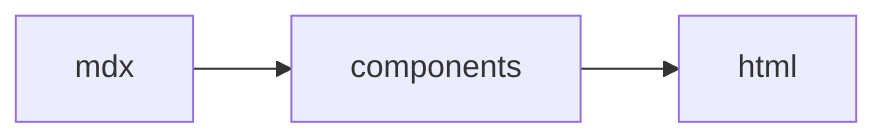

The frame every deliverable sits in — headers, callouts, navigation, references. Frontmatter `status:` / `date:` / `owner:` produced the badge and meta row above.

<Meta>
  <MetaItem label="Branch" icon="lucide:git-branch">docs/catalog</MetaItem>
  <MetaItem label="Repo" icon="lucide:github">mdxr</MetaItem>
</Meta>

:::toc

## Callouts

:::note
`:::note`, `> [!NOTE]` and `<Callout kind="note">` all produce this block.
:::

:::warning
Warnings get a yellow accent.
:::

:::goal
Goal blocks state intent.
:::

:::decision
Decision callouts mark choices that are settled.
:::

## Collapsible details

<Details summary="Native details — opens without JS">
Hidden until clicked. This one starts closed.
</Details>

<Details summary="Starts open" open>
The `open` attribute expands the section on load.
</Details>

## Glossary

<Glossary>
  <Term name="MDX">Markdown extended with JSX components.</Term>
  <Term name="Directive">`:::name` container mapping to a component.</Term>
</Glossary>

## References

<Ref href="https://mdxjs.com" title="MDX documentation">
The component model mdxr builds on.
</Ref>

Inline GitHub chips: <Issue repo="SuzumiyaAoba/mdxr" number="1" /> <PR repo="SuzumiyaAoba/mdxr" number="2" /> <Commit repo="SuzumiyaAoba/mdxr" sha="80c3b8d0123456789abcd">docs site</Commit>

## Commands and icons

Run <Cmd>pnpm build</Cmd> then <Cmd>mdxr render plan.mdx</Cmd> — inline chips carry copy buttons. Icons: <Icon name="lucide:rocket" className="h-4 w-4" /> <Icon name="lucide:check" className="h-4 w-4" /> <Icon name="vscode-icons:file-type-typescript" className="h-4 w-4" />

## Fenced code

```ts ln title="src/hello.ts"
const a = 1;
const b = 2; // [!code hl]
const c = a + b; // [!code warning]
return c;
```



## Task list

- [x] Render the demos
- [ ] Ship the docs
