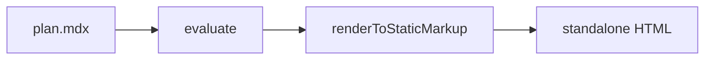

<Plan title="Renderer rewrite" status="doing" owner="@suzumiyaaoba" date="2026-09-10" version="v3" updated="2026-09-16">

<Summary done="4" total="9" label="Overall progress" />

:::goal
Replace the string-template renderer with a typed component pipeline.
:::

:::nongoal
Changes to the CLI surface or the document authoring model.
:::

## Context

See <FileRef path="src/render.ts" lines="12-40" /> for the current entry point.

<Meta>
  <MetaItem label="Branch" icon="lucide:git-branch">feat/renderer</MetaItem>
  <MetaItem label="Repo" icon="lucide:github">rv</MetaItem>
</Meta>

<Stats>
  <Stat value="68" label="call sites migrated" delta="+12" />
  <Stat value="120ms" label="p95 render time" delta="-34%" />
  <Stat value="9" label="packages affected" />
</Stats>

:::phase{title="Phase 1 — pipeline" status="done"}

<Steps progress>
  <Step status="done">MDX compile via `evaluate()`</Step>
  <Step status="done">Tailwind v4 runtime CSS generation</Step>
  <Step status="done">GFM conventions → components</Step>
</Steps>

:::

:::phase{title="Phase 2 — extensibility" status="doing" owner="@alice" due="2026-09-30"}

<Steps progress>
  <Step status="done" effort="s">
    esbuild-based user component loading
  </Step>
  <Step status="doing" priority="p1" owner="@alice" due="2026-09-18">
    `rv catalog --json` for agent discovery
  </Step>
  <Step status="todo" effort="m" owner="@bob">
    Watch-mode invalidation for custom components
  </Step>
  <Step status="blocked" priority="p0">
    Remote component registries
  </Step>
</Steps>

:::

## Options considered

<Columns>
  <Option title="Keep template literals" status="rejected">
    Escaping bugs keep recurring; no validation of document structure.
  </Option>
  <Option title="MDX component pipeline" status="recommended">
    Deterministic render, prop validation via valibot, extensible per project.
  </Option>
</Columns>

<Decision
  title="Use renderToStaticMarkup (sync)"
  status="accepted"
  date="2026-09-12"
>
  Documents have no data fetching — a synchronous renderer keeps the CLI simple
  and the output fully static.
</Decision>

:::timeline{title="Milestones"}

<Event date="2026-09-10" status="done" title="Skeleton renderer merged" />
<Event date="2026-09-15" status="doing" title="Custom component support" />
<Event date="2026-09-30" status="todo" title="v1.0 freeze" />

:::

## Risks

<Risk
  level="high"
  title="MDX ecosystem drift"
  mitigation="Pin @mdx-js/mdx; run weekly compat CI"
>
  `evaluate()` semantics changed across majors before.
</Risk>
<Risk level="low" title="Theme regressions">
  Storybook renders every example document on each build.
</Risk>

## Target structure

<Tree root="rv/">

- src/
  - render.ts — pipeline entry
  - ui/
    - plan.tsx
    - steps.tsx
  - remark/
    - directives.ts
- examples/
  - plan.mdx — this document

</Tree>

## Sign-off

<Approvals>
  <Approval name="alice" role="tech lead" status="approved" date="2026-09-14" />
  <Approval name="bob" role="security" status="pending" />
  <Approval name="carol" role="docs" status="changes-requested">
    Add migration notes for existing documents.
  </Approval>
</Approvals>

:::question
Ship the sandboxed evaluator behind a flag, or as a minor bump?
:::

<Ask title="Pending decisions" description="Check or fill in — answers are copied, not submitted.">
  <Question name="evaluator" type="choice" label="Sandboxed evaluator" required>
    <Choice value="flag" checked>Behind a flag</Choice>
    <Choice value="minor" description="No opt-out">Minor bump</Choice>
  </Question>
  <Question name="registries" type="toggle" label="Include remote registries in v1.0" />
  <Question name="freeze-date" type="text" label="Freeze date" placeholder="2026-09-30" />
</Ask>



```ts title="src/render.ts"
const { body } = await mdxToHtml(source, components, abs);
```

## References

<LinkCard href="https://mdxjs.com" title="MDX documentation">
  Component model used by the renderer.
</LinkCard>

- [x] catalog command
- [ ] theme override example

<Icon name="lucide:rocket" label="launch" className="h-5 w-5 text-teal-500" />
Inline icons via the `Icon` component — or a CSS-only mask icon on any element:
<span className="icon-[lucide--github] text-neutral-700 dark:text-neutral-200" />

</Plan>
