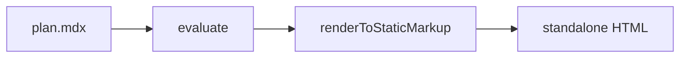

<Plan title="Renderer rewrite" status="doing">

<Summary done="4" total="9" label="Overall progress" />

## Context

Replace the string-template renderer with a component pipeline. See <FileRef path="src/render.ts" lines="12-40" /> for the current entry point.

> [!WARNING] The old `renderPage()` API is still used by the CLI — keep a shim.

:::phase{title="Phase 1 — pipeline" status="done"}

<Steps>
  <Step status="done">MDX compile via `evaluate()`</Step>
  <Step status="done">Tailwind v4 runtime CSS generation</Step>
  <Step status="done">GFM conventions → components</Step>
</Steps>

:::

:::phase{title="Phase 2 — extensibility" status="doing"}

<Steps>
  <Step status="done">esbuild-based user component loading</Step>
  <Step status="doing">`rv catalog --json` for agent discovery</Step>
  <Step status="todo">Watch-mode invalidation for custom components</Step>
  <Step status="blocked">Remote component registries</Step>
</Steps>

:::

<Timeline title="Milestones">
  <Event date="2026-09-10" status="done">
    Skeleton renderer merged
  </Event>
  <Event date="2026-09-15" status="doing">
    Custom component support
  </Event>
</Timeline>



:::decision Use `renderToStaticMarkup` (sync) — documents have no data fetching. :::

```ts title="src/render.ts"
const { body } = await mdxToHtml(source, components, abs);
```

- [x] catalog command
- [ ] theme override example

</Plan>
